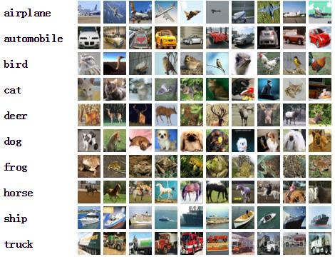

# Computer Vision (计算机视觉) Dataset

## Images

### MNIST

> The MNIST database of handwritten digits, available from this page, has a training set of 60,000 examples, and a test set of 10,000 examples. 

**From:** New York University,Google Labs,Microsoft Research

**Publish date:** 1998

**Paper:** [[Proceedings of the IEEE](https://ieeexplore.ieee.org/abstract/document/726791)] **Gradient-based learning applied to document recognition**

**Project page:** [[Link](http://yann.lecun.com/exdb/mnist/)]

### CIFAR

> The CIFAR-10 and CIFAR-100 are labeled subsets of the [80 million tiny images](http://people.csail.mit.edu/torralba/tinyimages/) dataset

**From:** New York University, Stanford University

**Publish date:** 2009.04.08

**Paper:** [[Citeseer](http://citeseerx.ist.psu.edu/viewdoc/download?doi=10.1.1.222.9220&rep=rep1&type=pdf)] **Learning Multiple Layers of Features from Tiny Images**

**Project page:** [[Link](http://www.cs.toronto.edu/~kriz/cifar.html)]

#### CIFAR-10

> The CIFAR-10 dataset consists of 60000 32x32 colour images in 10 classes, with 6000 images per class. There are 50000 training images and 10000 test images.
>
> The dataset is divided into five training batches and one test batch, each with 10000 images. The test batch contains exactly 1000 randomly-selected images from each class. The training batches contain the remaining images in random order, but some training batches may contain more images from one class than another. Between them, the training batches contain exactly 5000 images from each class.　
>
> 该数据集共有60000张彩色图像，这些图像是32*32，分为10个类，每类6000张图。这里面有50000张用于训练，构成了5个训练批，每一批10000张图；另外10000用于测试，单独构成一批。测试批的数据里，取自10类中的每一类，每一类随机取1000张。抽剩下的就随机排列组成了训练批。注意一个训练批中的各类图像并不一定数量相同，总的来看训练批，每一类都有5000张图。

**Download**

| **Version**                                                  | **Size** | **md5sum**                       |
| ------------------------------------------------------------ | -------- | -------------------------------- |
| [CIFAR-10 python version](http://www.cs.toronto.edu/~kriz/cifar-10-python.tar.gz) | 163 MB   | c58f30108f718f92721af3b95e74349a |
| [CIFAR-10 Matlab version](http://www.cs.toronto.edu/~kriz/cifar-10-matlab.tar.gz) | 175 MB   | 70270af85842c9e89bb428ec9976c926 |
| [CIFAR-10 binary version (suitable for C programs)](http://www.cs.toronto.edu/~kriz/cifar-10-binary.tar.gz) | 162 MB   | c32a1d4ab5d03f1284b67883e8d87530 |

#### CIFAR-100

> This dataset is just like the CIFAR-10, except it has 100 classes containing 600 images each. There are 500 training images and 100 testing images per class. The 100 classes in the CIFAR-100 are grouped into 20 superclasses. Each image comes with a "fine" label (the class to which it belongs) and a "coarse" label (the superclass to which it belongs).
>
> CIFAR100和CIFAR-10类似，它有100个类，每个类包含600个图像，其中500个训练图像和100个测试图像

| **Superclass**                 | **Classes**                                           |
| ------------------------------ | ----------------------------------------------------- |
| aquatic mammals                | beaver, dolphin, otter, seal, whale                   |
| fish                           | aquarium fish, flatfish, ray, shark, trout            |
| flowers                        | orchids, poppies, roses, sunflowers, tulips           |
| food containers                | bottles, bowls, cans, cups, plates                    |
| fruit and vegetables           | apples, mushrooms, oranges, pears, sweet peppers      |
| household electrical devices   | clock, computer keyboard, lamp, telephone, television |
| household furniture            | bed, chair, couch, table, wardrobe                    |
| insects                        | bee, beetle, butterfly, caterpillar, cockroach        |
| large carnivores               | bear, leopard, lion, tiger, wolf                      |
| large man-made outdoor things  | bridge, castle, house, road, skyscraper               |
| large natural outdoor scenes   | cloud, forest, mountain, plain, sea                   |
| large omnivores and herbivores | camel, cattle, chimpanzee, elephant, kangaroo         |
| medium-sized mammals           | fox, porcupine, possum, raccoon, skunk                |
| non-insect invertebrates       | crab, lobster, snail, spider, worm                    |
| people                         | baby, boy, girl, man, woman                           |
| reptiles                       | crocodile, dinosaur, lizard, snake, turtle            |
| small mammals                  | hamster, mouse, rabbit, shrew, squirrel               |
| trees                          | maple, oak, palm, pine, willow                        |
| vehicles 1                     | bicycle, bus, motorcycle, pickup truck, train         |
| vehicles 2                     | lawn-mower, rocket, streetcar, tank, tractor          |

**Download**

| **Version**                                                  | **Size** | **md5sum**                       |
| ------------------------------------------------------------ | -------- | -------------------------------- |
| [CIFAR-100 python version](http://www.cs.toronto.edu/~kriz/cifar-100-python.tar.gz) | 161 MB   | eb9058c3a382ffc7106e4002c42a8d85 |
| [CIFAR-100 Matlab version](http://www.cs.toronto.edu/~kriz/cifar-100-matlab.tar.gz) | 175 MB   | 6a4bfa1dcd5c9453dda6bb54194911f4 |
| [CIFAR-100 binary version (suitable for C programs)](http://www.cs.toronto.edu/~kriz/cifar-100-binary.tar.gz) | 161 MB   | 03b5dce01913d631647c71ecec9e9cb8 |

#### ImageNet

> This dataset spans 1000 object classes and contains 1,281,167 training images, 50,000 validation images and 100,000 test images.
>
> 训练集：1,281,167张图片+标签
> 验证集：50,000张图片+标签
> 测试集：100,000张图片

**From:** Stanford University, Princeton University

**Publish date:** 2009.06.25

**Paper:** [[CVPR'09](https://ieeexplore.ieee.org/abstract/document/5206848)]  **ImageNet: A Large-Scale Hierarchical Image Database**

**Project page:** [[Link](https://image-net.org/)]

**Download:** [[Kaggle](https://www.kaggle.com/c/imagenet-object-localization-challenge/data)] Size: 166G

#### SVHN (Street View House Number)

> SVHN is a real-world image dataset . It can be seen as similar in flavor to MNIST (e.g., the images are of small cropped digits), but incorporates an order of magnitude more labeled data (over 600,000 digit images) and comes from a significantly harder, unsolved, real world problem (recognizing digits and numbers in natural scene images). SVHN is obtained from house numbers in Google Street View images.
>
> Dateset 来源于谷歌街景门牌号码，每张图片中包含一组 ‘0-9’ 的阿拉伯数字。图片如下图所示,训练集中包含 73257 个数字，测试集中包含 26032 个数字，另有 531131 个附加数字。
> 10 classes, 1 for each digit. Digit '1' has label 1, '9' has label 9 and '0' has label 10. 73257 digits for training, 26032 digits for testing, and 531131 additional, somewhat less difficult samples, to use as extra training data
>Comes in two formats:
> 1. Original images with character level bounding boxes.
> 2. MNIST-like 32-by-32 images centered around a single character (many of the images do contain some distractors at the sides).

**From:** Stanford University

**Publish date:** 2011

**Paper:** [[NeurIP'09](https://research.google/pubs/pub37648/)]  **Reading Digits in Natural Images with Unsupervised Feature Learning**

**Project page:** [[Link](http://ufldl.stanford.edu/housenumbers/)]

**Download:** [[Link](http://ufldl.stanford.edu/housenumbers/)] 

#### iNaturalist2018 (动物昆虫识别)

> There are a total of 8,142 species in the dataset, with 437,513 training images, and 24,426 validation images. Each image has one ground truth label.

**From:** Amazon AWS

**Publish date:** 2018.02

**Project page:** [[Github](https://github.com/visipedia/inat_comp/tree/master/2018)]

**Download:** [[Github](https://github.com/visipedia/inat_comp/tree/master/2018)] **Size:** 158.38G

**Details**
There are a total of 8,142 species in the dataset, with 437,513 training images, 24,426 validation images, and 149,394 test images.

| Super Category | Category Count | Train Images | Val Images |
| -------------- | -------------- | ------------ | ---------- |
| Plantae        | 2,917          | 118,800      | 8,751      |
| Insecta        | 2,031          | 87,192       | 6,093      |
| Aves           | 1,258          | 143,950      | 3,774      |
| Actinopterygii | 369            | 7,835        | 1,107      |
| Fungi          | 321            | 6,864        | 963        |
| Reptilia       | 284            | 22,754       | 852        |
| Mollusca       | 262            | 8,007        | 786        |
| Mammalia       | 234            | 20,104       | 702        |
| Animalia       | 178            | 5,966        | 534        |
| Amphibia       | 144            | 11,156       | 432        |
| Arachnida      | 114            | 4,037        | 342        |
| Chromista      | 25             | 621          | 75         |
| Protozoa       | 4              | 211          | 12         |
| Bacteria       | 1              | 16           | 3          |
|                |                |              |            |
| Total          | 8,142          | 437,513      | 24,426     |

