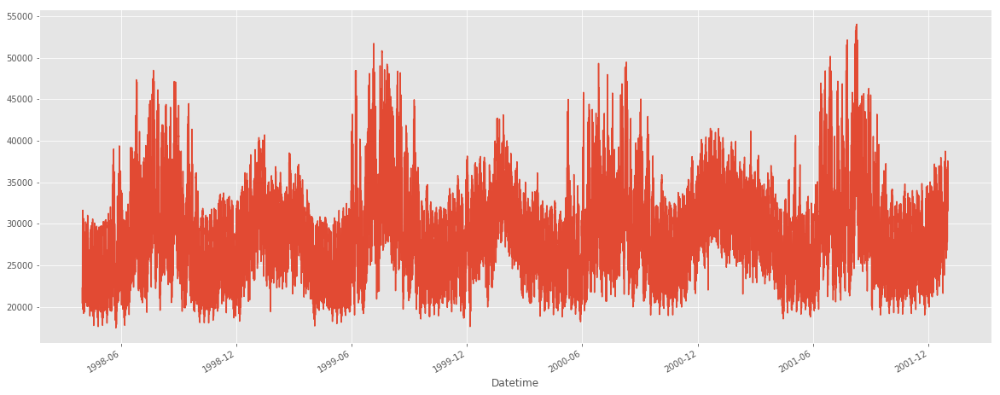

# Energy (能源) Dataset
## Electricity
### PJM Hourly Energy Consumption Data

> PJM Interconnection LLC (PJM) is a regional transmission organization (RTO) in the United States. It is part of the Eastern Interconnection grid operating an electric transmission system serving all or parts of Delaware, Illinois, Indiana, Kentucky, Maryland, Michigan, New Jersey, North Carolina, Ohio, Pennsylvania, Tennessee, Virginia, West Virginia, and the District of Columbia.

**Publish date: ** 2018

**Download:**

- [Kaggle](https://www.kaggle.com/robikscube/hourly-energy-consumption)
- Size: 46.28MB
- Type: csv

### Smart meters in London

> Energy consumption readings for a sample of 5,567 London Households that took part in the UK Power Networks led Low Carbon London project between November 2011 and February 2014

**From: ** UK Government

**Publish date: ** 2013

**Project page: ** [[Link](https://innovation.ukpowernetworks.co.uk/)]

**Download:** 

- [[Link](https://data.london.gov.uk/dataset/smartmeter-energy-use-data-in-london-households)] [[Kaggle](https://www.kaggle.com/jeanmidev/smart-meters-in-london)]
- The dataset contains energy consumption, in kWh (per half hour), unique household identifier, date and time. The CSV file is around 10GB when unzipped and contains around 167million rows.
- **Dataset analysis:** [[Link](https://data.london.gov.uk/blog/electricity-consumption-in-a-sample-of-london-households/)]

## References

1. 

